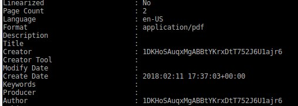
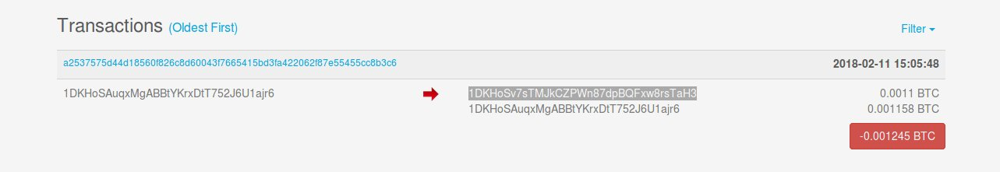
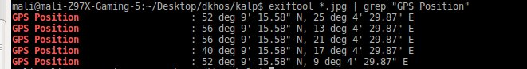
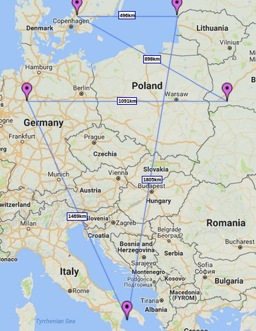
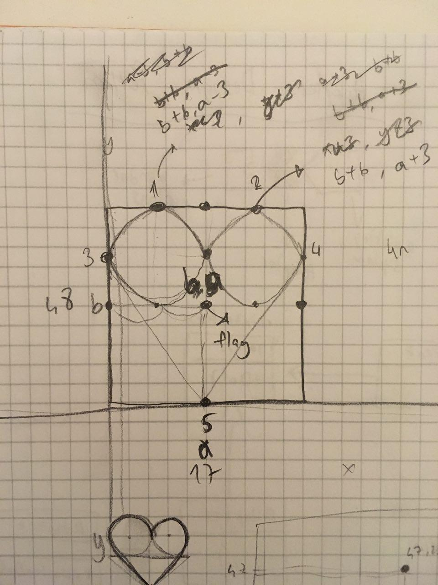

### Beni kalbimin ortasından vurdun Pelinsu (Cyber Intelligence 500)
Bu soru da her adimdaki ip uclarini takip ederek ilerledigimiz sorulardan biriydi. Soruyu cozmek icin bir cok farkli yazilim kullanmamiz gerekiyordu.

Ilk olarak bize verilen fotografi indirip meta datasina bakiyoruz:


```
...
Artist                          : www.dkhos.com/m/missingpdf.jpg
...
```

Artist alanindaki adrese gittigimizde baska bir jpg dosyasi buluyoruz:


Bu resimin en altindaki sogan resmi bize hemen TOR Networku hatirlatiyor. Yukaridaki 16 satir da tor'da gitmemiz gereken adresin her bir karakterine karsilik gelecek gibi gorunuyor ancak cozmemiz icin baska bir dosya gerekiyor.
Bu resmin meta datasina baktigimizda Artist alaninda gene ilginc bir deger oldugunu goruyoruz:
```
Artist                          : X9WG+8F
```
Bu adresleri kisaltmak ve uluslar arasi kullanimlarini kolaylastirmak icin kullanilan [plus code'lara](https://plus.codes) benziyor. Ancak bu plus kodun basinda global kismi yok. Bu nedenle gitmemiz gereken sehir ismini yazmazsak dunyada gitmemiz gereken yere gidemeyiz. Bunun icin yeniden metadataya donuyoruz:
```
Image Description               : Delft, Netherlands
```

Bu bilgilerle artik Google Maps'e girip sirdaki ip ucunu arayabiliriz:


Bu pdf TOR linkini bulmamiz icin gerekli. Resimdeki sayilarin sirasiyla pdfdeki paragraf, kelime ve karakter sayilarina karsilik geldigini dusunerek URL'mizi olusturuyoruz: http://dkhosweozgaqjxxh.onion.to/

Ayrıca indirdiğimiz pdfe exiftool ile bakmamazlık yapmıyoruz


Onion linkiyle indirdiğimiz torrenti i2p kurarak bilgisayarımıza indiriyoruz ve bir zip dosyasıyla karşılaşıyoruz. Ancak bize password gerekli.

Bir önceki author bilgisindeki stringi parola olarak denedik ama olmadı. Ardından bu değerin bir wallet değeri oldugunu düşündük
Blockchain infodan hemen transactionlara baktık ve bir diğer adresi bulduk
 

Bu degeri password olarak kullandık ve 5 tane resimle karşılaştık exiftool ile yine bu resimlerin detaylarına baktık
 

Burada buldugumuz koordinatları hemen convert ettik ve bir mapte işaretledik.
 

Bildigimiz bütün orta nokta formüllerini denedik. Ancak bir sonuca ulaşamadık. Ardından DKHOS twitter hesabından verilen ipucunu gördük ve hemen kullandık.
 

Hızlı bir hesapla orta noktayı bulup google mapste arattık. ve flag karşımızdaydı. Ayrıca soruyu ilk çözen ekip olarak +50 puanımızı da aldık ^^

DKHOS_{ALLEXIS}
