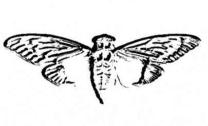
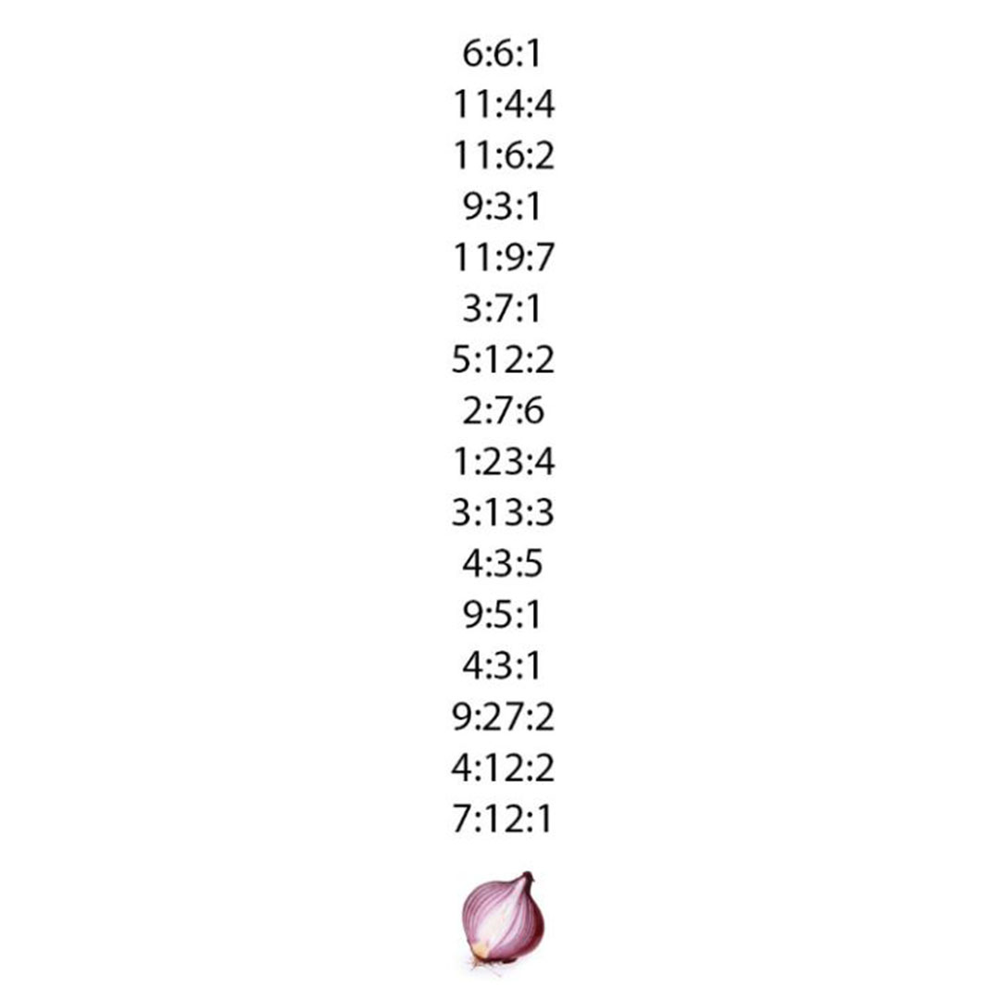
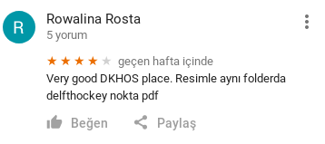

### Beni kalbimin ortasından vurdun Pelinsu (Cyber Intelligence 500)
Bu soru da her adimdaki ip uclarini takip ederek ilerledigimiz sorulardan biriydi. Soruyu cozmek icin bir cok farkli yazilim kullanmamiz gerekiyordu.

Ilk olarak bize verilen fotografi indirip meta datasina bakiyoruz:


```
...
Artist                          : www.dkhos.com/m/missingpdf.jpg
...
```

Artist alanindaki adrese gittigimizde baska bir jpg dosyasi buluyoruz:



Bu resimin en altindaki sogan resmi bize hemen TOR Networku hatirlatiyor. Yukaridaki 16 satir da tor'da gitmemiz gereken adresin her bir karakterine karsilik gelecek gibi gorunuyor ancak cozmemiz icin baska bir dosya gerekiyor.
Bu resmin meta datasina baktigimizda Artist alaninda gene ilginc bir deger oldugunu goruyoruz:
```
Artist                          : X9WG+8F
```
Bu adresleri kisaltmak ve uluslar arasi kullanimlarini kolaylastirmak icin kullanilan [plus code'lara](https://plus.codes) benziyor. Ancak bu plus kodun basinda global kismi yok. Bu nedenle gitmemiz gereken sehir ismini yazmazsak dunyada gitmemiz gereken yere gidemeyiz. Bunun icin yeniden metadataya donuyoruz:
```
Image Description               : Delft, Netherlands
```

Bu bilgilerle artik Google Maps'e girip sirdaki ip ucunu arayabiliriz:



Bu pdf TOR linkini bulmamiz icin gerekli. Resimdeki sayilarin sirasiyla pdfdeki paragraf, kelime ve karakter sayilarina karsilik geldigini dusunerek URL'mizi olusturuyoruz: http://dkhosweozgaqjxxh.onion.to/
