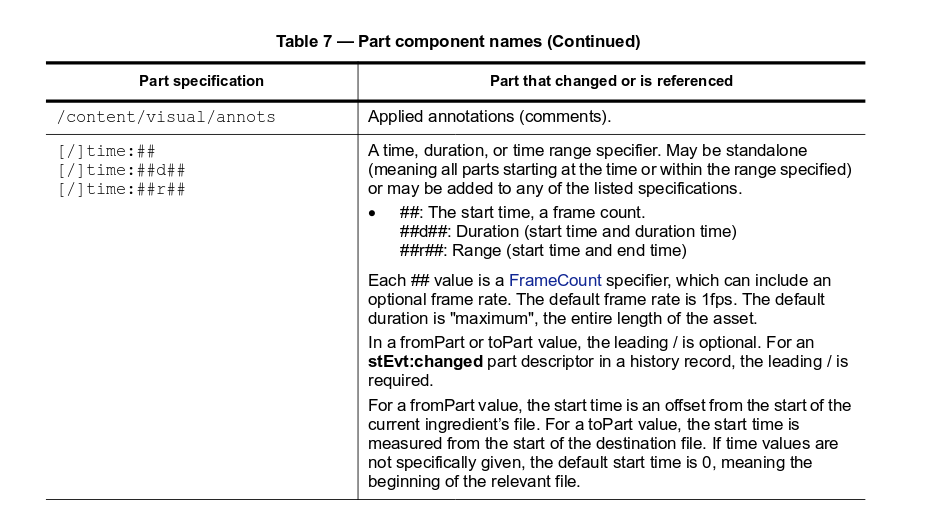
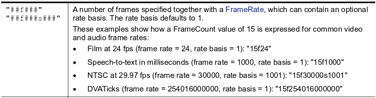

### Karanlıkta arayış başlar (Forensic 100)
Yarismanin ilk sorusu. Dosya linkine bastigimizda 6 saatlik bir video oldugunu goruyoruz.
Ilk bakista videonun tamami siyah bir ekrandan olusuyor gibi gorunuyor. Hemen videoyu indirip exiftool ile
meta datasini inceliyoruz.

```
exiftool 26b8351bdd03ce6d1d683bc38786aa3ea2432d45.mp4

...
XMP Toolkit                     : Adobe XMP Core 5.6-c067 79.157747, 2015/03/30-23:40:42
Creator Tool                    : Adobe Premiere Pro CC 2015 (Windows)
...
Ingredients Instance ID         : 02d17d1d-c0c1-217d-4084-957400000068, 91d02011-6d0d-77cb-990e-54530000006a, 91d02011-6d0d-77cb-990e-54530000006a, 91d02011-6d0d-77cb-990e-54530000006a, 91d02011-6d0d-77cb-990e-54530000006a
Ingredients Document ID         : 4b1048e0-b00c-3347-ffa0-80860000003b, 5795f2a9-2a50-6d49-2fb8-c9000000003d, 5795f2a9-2a50-6d49-2fb8-c9000000003d, 5795f2a9-2a50-6d49-2fb8-c9000000003d, 5795f2a9-2a50-6d49-2fb8-c9000000003d
Ingredients From Part           : time:0, time:0, time:0, time:0, time:0
Ingredients To Part             : time:3984383208960000f254016000000d10160640000f254016000000, time:0d1999766361600000f254016000000, time:1999766361600000f254016000000d1984616847360000f254016000000, time:3984393369600000f254016000000d3119316480000f254016000000, time:3987512686080000f254016000000d1508143795200000f254016000000
Ingredients File Path           : flag.jpg, black.jpg, black.jpg, black.jpg, black.jpg
Ingredients Mask Markers        : None, None, None, None, None
...
```

Yukarda azcik kirptigim komut ciktisinda hemen bu kisimlar ilgimizi cekiyor tabi ki.
Ilk kisimda videonun Adobe Premier ile olusturuldugunu goruyoruz. Ikinci kisimda da videoyu olusturmak icin kullanilan resim dosyalari ile ilgili bilgiler var.
Flag'in de videonun icinde kisa bi sure gectigini goruyoruz, ama nerde.
Bunun cevabi da hemen ustteki satirin ilk kisminda.

```
Ingredients To Part: time:3984383208960000f254016000000d10160640000f254016000000
```

Bu sayilarin bize her resmin videodaki yerleriyle ilgili bize bilgi veriyor.
Bu formati cozmek icin ufak bir arama yaptigimizda karsimiza Adobe'un XMP spesifikasyonlarindan bahsettigi bu [pdf](http://wwwimages.adobe.com/www.adobe.com/content/dam/acom/en/devnet/xmp/pdfs/XMP%20SDK%20Release%20cc-2016-08/XMPSpecificationPart2.pdf) cikiyor.
Ilgili kisimlari kopyalayalim:




Simdi flag.jpg'nin gorundugu frame'i hesaplayabiliriz.

```
Duration kismini ikiye bolersek:
3984383208960000f254016000000 d  10160640000f254016000000

Baslangic framei: 3984383208960000f254016000000
Bitis framei: 10160640000f254016000000

Frame count spesifikasyonlarina baktigimizda:
3984383208960000 f 254016000000
Frame numarasi : 3984383208960000
Frame rate: 254016000000

Videonun oynadigi frame rate ile elimizdeki deger uyusmadigi icin dogru frame numarasini bulmaliyiz.

3984383208960000 / 254016000000 = 15685,56
Bu degeri videonun export edildigi frame rate olan 25le carptigimizda dogru baslangic frame'ine ulasiyoruz.
15685,56 × 25 = 392139
```
