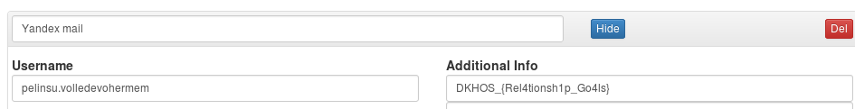

### Yamtar (Web 100)

Sorudaki linki actigimizda header'inda EveryPass yazan bir sayfa ile karsilasiyoruz. Internette aradigimizda bunun self-contained html dosyalari
icinde bir password manager oldugunu goruyoruz. Master-Password'e hint olarak
"PIN" yazilmasi ve bunun ilk web sorusu olmasi nedeniyle password'un 4 rakamdan olustugunu ve kolayca brute force ile kirilabilecegini varsayip bunu bir Greasemonkey scriptiyle yapmaya karar verdim.

```
// ==UserScript==
// @name     Unnamed Script 542710
// @include  http://54.209.167.162/
// @version  1
// @grant    none
// ==/UserScript==


alert ("Script start.");


i = 1000


while(i < 10000){
  document.getElementById("dec-password").value = i;
  var evt = document.createEvent ("HTMLEvents");
  evt.initEvent ("click", true, true);
  document.getElementById('do-decrypt').dispatchEvent (evt);
  pass_group = document.getElementById('dec-password-group')
  console.log(i)
  i++

}
```

Program kisa bir sure calisip web sayfasini kastirdiktan sonra karsimiza tek bir sifre cikiyor. Ayrintilarina baktigimizda ise flag'i buluyoruz.


